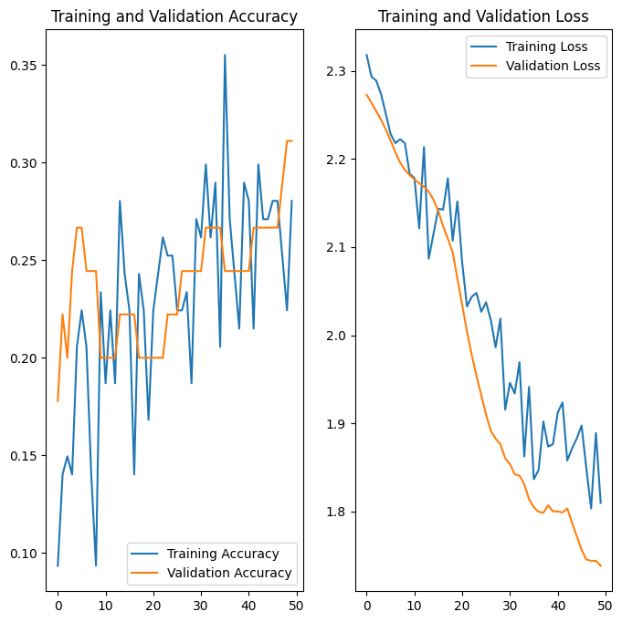

# PROJECT TITLE

Tomato Disease Classification Model

## NON-TECHNICAL EXPLANATION OF YOUR PROJECT

- The Tomato Disease Classification Model is like a smart assistant designed to help farmers, agricultural technicians, and companies involved in agriculture. It uses pictures of tomato leaves to quickly tell if a plant is healthy or sick, and what kind of sickness it has. This tool is especially useful because it can help catch diseases early, allowing for faster treatment and less damage to crops.

## DATA

- !reference "data_sheet.md"

## MODEL

- The Tomato Disease Classification Model is built on a Convolutional Neural Network (CNN), specifically leveraging the ResNet-50 architecture, chosen for its robustness and efficiency in handling image recognition tasks.

## HYPERPARAMETER OPTIMSATION

- Learning Rate
- Batch Size
- Number of Epochs
- Optimizer
- Regularization Technique (Batch Normalization, Dropout)

## RESULTS

- Model is still going through optimisation/improve
- More data and data refinement is needed
- Futher funing is required

You can include images of plots using the code below:

## (OPTIONAL: CONTACT DETAILS)

- Email: btinfo.demola@gmail.com
